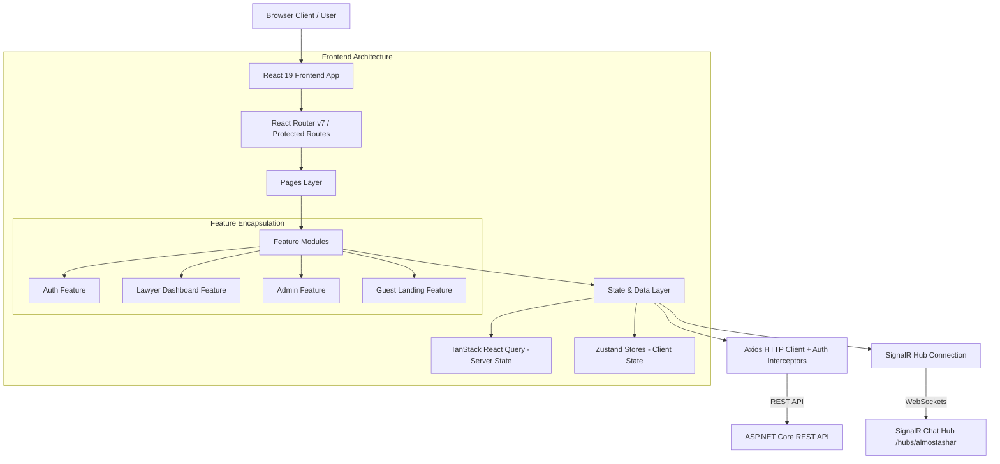

# ⚖️ Almostashar Web 

[](https://react.dev/)
[](https://vitejs.dev/)
[](https://tailwindcss.com/)
[](https://reactrouter.com/)
[](https://github.com/pmndrs/zustand)
[](https://tanstack.com/query/latest)
[](https://react-hook-form.com/)
[](https://github.com/jquense/yup)
[](https://dotnet.microsoft.com/apps/aspnet/signalr)
[](LICENSE)

**Almostashar** is a state-of-the-art digital legal marketplace and consultation platform. It bridges the gap between clients seeking legal advice or representation and verified, licensed lawyers across various legal domains. Built with modern web technologies, real-time WebSocket communication, and robust role-based security, the web application delivers a seamless experience for Clients, Lawyers, and Administrators.

---

## 🎯 Core Project Idea

The core goal of **Almostashar** is to digitize and democratize legal services. It transforms traditional, friction-heavy legal consultations into an accessible, transparent, and efficient digital experience.

### Key Objectives:
- **Client Empowerment**: Enables clients to discover verified legal professionals, browse service catalogs, submit legal requests/tenders, and communicate directly through real-time encrypted channels.
- **Lawyer Workspace**: Offers licensed lawyers a centralized hub to showcase their expertise, manage cases, respond to clients, bid on legal tenders, and manage their earnings and digital wallet withdrawals.
- **Administrative Oversight**: Equips platform administrators with verification suites to validate lawyer credentials, arbitrate legal service disputes, and manage financial payouts safely.

---

## 🏗️ System Architecture

Almostashar Web follows a **Feature-Based Modular Architecture** combined with **Domain-Driven Design (DDD)** concepts on the frontend. Code is grouped around core business capabilities rather than purely technical roles.




### Architectural Principles:
1. **Feature Encapsulation**: Each feature (`auth`, `lawyer-dashboard`, `admin-disputes`, etc.) functions as a self-contained module with its own `api`, `components`, `hooks`, and `store`.
2. **Public API Barrier (`index.js`)**: Internal components and implementation details of a feature are hidden behind an explicit `index.js` export. External modules only import from `features/<feature-name>`.
3. **Unidirectional Data Flow & Resilience**:
   - Asynchronous server state is managed via **TanStack React Query** with automated caching and invalidation.
   - Synchronous client/session state is managed via **Zustand** with persistent storage.
   - Automatic HTTP 401 handling via custom **Axios request/response interceptors** featuring silent JWT refresh queues.

---

## ⭐ Key Features

### 🔑 1. Authentication & Security
- **Multi-Role Support**: Access control tailored for `Client`, `Lawyer`, and `Admin`.
- **JWT & Silent Token Refresh**: Seamless session persistence using access and refresh tokens handled silently in the background.
- **Role-Based Guarding (`ProtectedRoute`)**: Page-level security ensuring users can only navigate within their authorized boundaries.
- **Lawyer Onboarding Workflow**: Multi-step registration wizard collecting identity verification documents (Syndicate Card, National ID, License).

### 👨‍⚖️ 2. Lawyer Dashboard & Operations
- **Case & Request Management**: Dedicated workspace to track incoming requests (الطلبات) and active legal cases (القضايا).
- **Legal Tenders Marketplace**: Browse, filter, and bid on public client tenders (المناقصات).
- **Service Catalog Management**: Define legal service packages, pricing, and consultation terms.
- **Digital Wallet & Withdrawals**: Track accumulated earnings, view transaction logs, and initiate bank payout requests.

### 💬 3. Real-Time Chat & Communications
- **SignalR Integration**: Powered by `@microsoft/signalr` connected to `/hubs/almostashar`.
- **Instant Messaging**: Real-time communication between clients and assigned legal advisors.
- **Connection Management**: Automatic reconnection logic with standard backoff strategy (`[0, 2000, 5000, 10000, 30000]ms`) and status notifications.

### 🛠️ 4. Admin Management Suite
- **Identity Verification Portal**: Review pending lawyer registrations, inspect uploaded credentials, and approve/reject applications.
- **Dispute Resolution System**: Track client-lawyer disputes, inspect evidence, and manage arbitration decisions.
- **Financial Payout Approvals**: Verify and process lawyer wallet withdrawal requests.

### 🌐 5. Guest & Client Portal
- **Interactive Landing Page**: Showcase featured legal specializations, top advisors, and mobile app download links.
- **Lawyer Directory**: Search and filter lawyers by legal domain, rating, and experience.
- **Detailed Service Views**: View comprehensive service descriptions and request consultations directly.

## 📂 Project Structure

```text
almostashar-web/
├── public/                     # Static assets and favicon
├── src/
│   ├── assets/                 # Images, media files, and global static resources
│   ├── components/             # Reusable global UI components & system error pages
│   │   ├── ui/                 # Atomic UI components (Buttons, Inputs, Modals, Badges)
│   │   └── ErrorPage.jsx       # Standardized fallback & error boundary display
│   ├── features/               # Feature-based domain modules (Core Architecture)
│   │   ├── admin-dashboard/    # Admin metrics and overview stats
│   │   ├── admin-disputes/     # Case dispute arbitration interfaces
│   │   ├── admin-verification/ # Lawyer identity credential verification
│   │   ├── admin-withdrawals-requests/ # Financial withdrawal management
│   │   ├── auth/               # Login, Lawyer registration, and identity upload
│   │   │   ├── api/            # Authentication HTTP requests
│   │   │   ├── components/     # Forms (LoginForm, UploadFilesForm, etc.)
│   │   │   ├── hooks/          # Custom auth hooks (useLogin, useRegisterLawyer)
│   │   │   ├── store/          # Zustand authStore & lawyerRegisterStore
│   │   │   └── index.js        # Feature Public API export
│   │   ├── documents/          # Attachment and document management
│   │   ├── guest-landing/      # Public homepage, hero banners, and service highlights
│   │   └── lawyer-dashboard/   # Lawyer hub, cases, services, wallet & SignalR chat
│   │       └── signalr/        # SignalR chatHub connection singleton
│   ├── hooks/                  # Shared global utility hooks
│   ├── pages/                  # Page-level containers (combines feature modules)
│   ├── routes/                 # Routing configuration & access guards
│   │   ├── AppRoutes.jsx       # Main application router definition
│   │   └── ProtectedRoute.jsx  # Role-Based Access Control wrapper
│   ├── services/               # Common low-level services
│   │   └── api/
│   │       └── axios.js        # Axios instance with refresh interceptors & error unwrapping
│   ├── store/                  # Global shared stores
│   ├── utils/                  # Helper functions and formatters
│   ├── App.jsx                 # Application entry point component
│   ├── main.jsx                # React root bootstrap & QueryClientProvider setup
│   └── index.css               # Base Tailwind CSS directives and global theme styles
├── .env.example                # Template for environment variables
├── eslint.config.js            # Code quality and ESLint 9 configuration
├── index.html                  # HTML template
├── package.json                # Project dependencies and script scripts
├── postcss.config.js           # PostCSS configuration
├── tailwind.config.js          # Tailwind CSS styling configuration
├── vercel.json                 # Vercel deployment configuration
└── vite.config.js              # Vite build setup
```

---

## 💻 Tech Stack

### **Core Frontend Stack**
- **Framework**: [React 19](https://react.dev/)
- **Build Tool**: [Vite 7](https://vitejs.dev/)
- **Styling Framework**: [Tailwind CSS v3](https://tailwindcss.com/)
- **Icons**: [Lucide React](https://lucide.dev/)

### **State & Networking**
- **State Management**: [Zustand v5](https://github.com/pmndrs/zustand) (with `persist` middleware)
- **Server Data Fetching & Caching**: [TanStack React Query v5](https://tanstack.com/query/latest)
- **HTTP Client**: [Axios v1](https://axios-http.com/)
- **Real-Time WebSockets**: [@microsoft/signalr v10](https://learn.microsoft.com/en-us/aspnet/core/signalr/)

### **Forms & Validation**
- **Form Handling**: [React Hook Form v7](https://react-hook-form.com/)
- **Schema Validation**: [Yup](https://github.com/jquense/yup) via `@hookform/resolvers`

### **Routing & Tools**
- **Client Routing**: [React Router DOM v7](https://reactrouter.com/)
- **Linting**: [ESLint v9](https://eslint.org/)

---

## 🚀 Getting Started

Follow these instructions to set up and run the project on your local environment.

### 1. Prerequisites
Ensure you have the following installed on your system:
- **Node.js**: `v18.0.0` or higher (LTS recommended)
- **Package Manager**: `npm` (v9+), `pnpm`, or `yarn`
- **Git**: Installed and configured

### 2. Installation

1. **Clone the Repository**:
   ```bash
   git clone https://github.com/Mohamed-ALQarram/almostashar-web.git
   cd almostashar-web
   ```

2. **Install Dependencies**:
   ```bash
   npm install
   ```

3. **Configure Environment Variables**:
   Create a `.env` file in the root directory by copying the example environment file:
   ```bash
   cp .env.example .env
   ```
   *Optional configuration options in `.env`:*
   ```env
   VITE_APP_STORE_LINK=https://apps.apple.com/app/idYOUR_APP_ID
   VITE_GOOGLE_PLAY_LINK=https://play.google.com/store/apps/details?id=com.your.package.name
   ```

---

### 3. Development & Build Scripts

| Command | Description |
| :--- | :--- |
| `npm run dev` | Starts the Vite local development server (default: `http://localhost:5173`) |
| `npm run build` | Builds optimized production artifacts into the `dist/` folder |
| `npm run preview` | Locally previews the production build output |
| `npm run lint` | Runs ESLint to check for code quality and formatting issues |

---

## 🛠️ Code Conventions & Feature Guidelines

When adding new features or modifying the codebase, adhere to the following rules:

1. **Feature Separation**: Place domain-specific logic, APIs, and UI components inside `src/features/<feature-name>`.
2. **Strict Public API Access**: Export public feature items via `src/features/<feature-name>/index.js`. Do not import from internal sub-paths outside the feature directory.
3. **State Splitting**:
   - Use **Zustand** for UI state, multi-step forms, and authentication sessions.
   - Use **TanStack Query** for all server asynchronous operations (GET/POST/PUT/DELETE).
4. **API Integration**: Utilize the central Axios instance from `src/services/api/axios.js` to ensure request authorization headers and error transformations are automatically applied.

---

## 📄 License

This project is licensed under the MIT License - see the [LICENSE](LICENSE) file for details.
